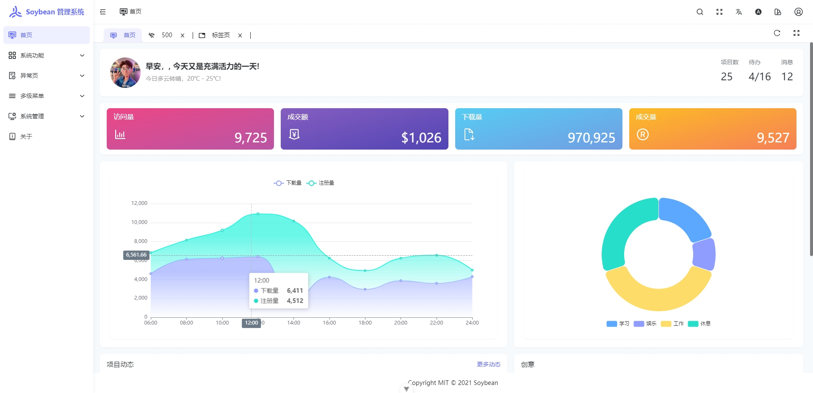
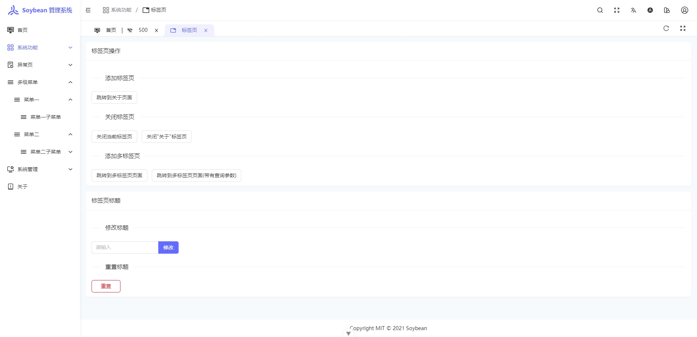
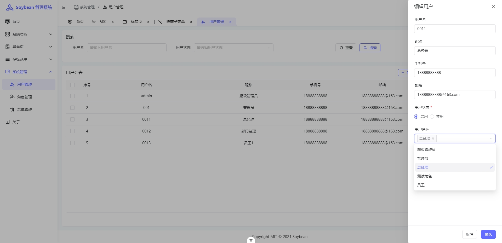
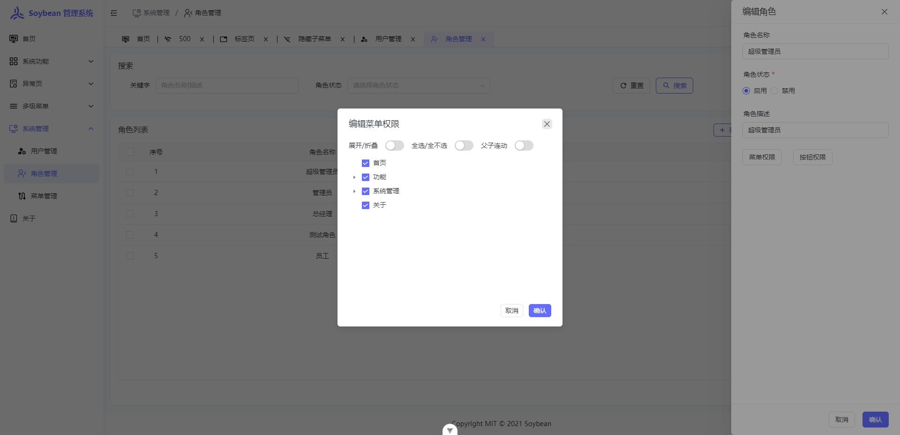
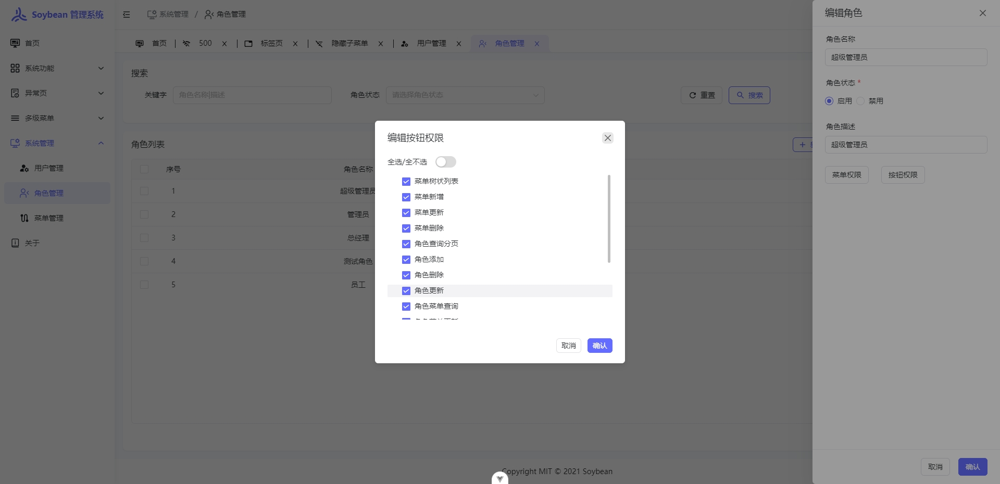
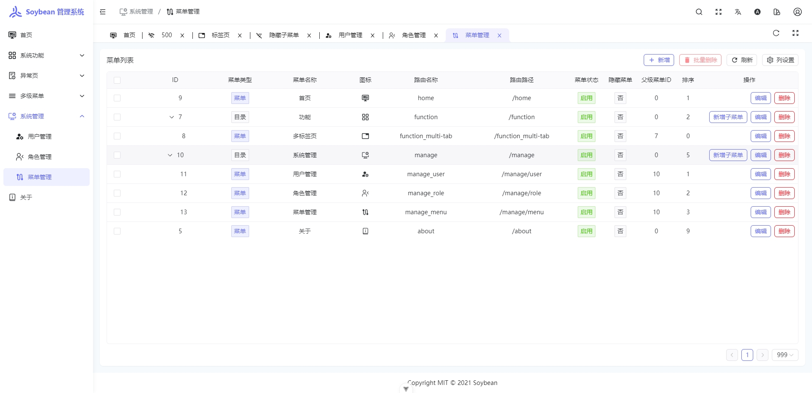
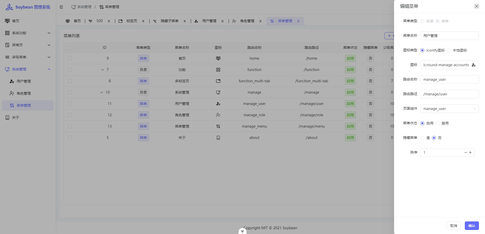
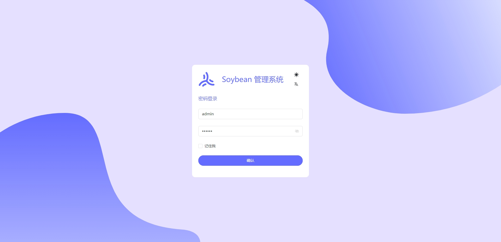

<h1 align="center" style="margin: 30px 0 30px; font-weight: bold;">MalusAdmin</h1>
<h4 align="center">基于 Vue3/TypeScript/NaiveUI 和 NET7 & Sqlsugar  开发的后台管理框架。</h4>

    
    
    

## 简介

基于NET Core  | NET7 & Sqlsugar  | Vue3 | vite4 | TypeScript | NaiveUI  开发的后台管理框架,提供快速开发解决方案。 

## 特性

前后端分离，使用 JWT 认证。

后端：基于 .NET7 和 [sqlsugar](https://www.donet5.com/Home/Doc?typeId=1215) ，集成常用组件，从0到1搭建。

前端：基于 [Soybean Admin](https://gitee.com/honghuangdc/soybean-admin) 做适配，主技术栈：Vue3、**NaiveUI 版本**

## 预览

- **账户**
  >  账号：admin   
  密码：1Q2W3E
- **演示**
   >   [maluts.hunji.xyz](https://maluts.hunji.xyz) 
- **文档**
  > [www.dotnetshare.com](https://www.dotnetshare.com/) 

## 演示

<table>
    <tr>
        <td></td>
        <td></td>
        <td></td>
    </tr>
    <tr>
        <td></td>
        <td></td>
        <td></td>
    </tr>
    <tr>
        <td></td>
        <td></td>
        <td></td>
    </tr>

</table>

 ## 交流

- 请移步右上角  **一键三连** :kissing_heart
- 公众号：
- 若发现bug，请提Issues。

## 开源

**源于开源，回归开源**

* 感谢Soybean Admin开源的[Soybean Admin](https://gitee.com/honghuangdc/soybean-admin) 
* 感谢SqlSugar开源的[SqlSugar](https://www.donet5.com/Home/Doc?typeId=1215) 
* 感谢Naive UI 开源的[Naive UI](https://www.naiveui.com/zh-CN/os-theme)
* 感谢 柒愿 开源的[QiAdmin](https://gitee.com/zero202101/QiAdmin)