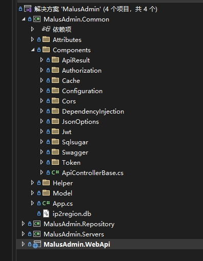
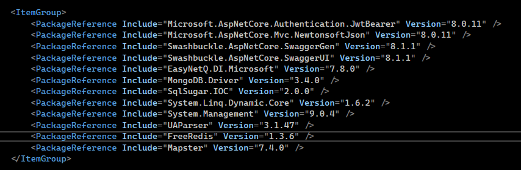
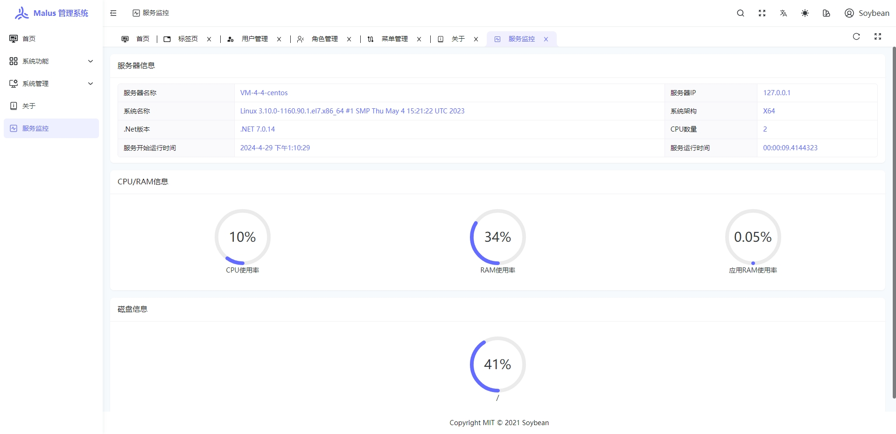
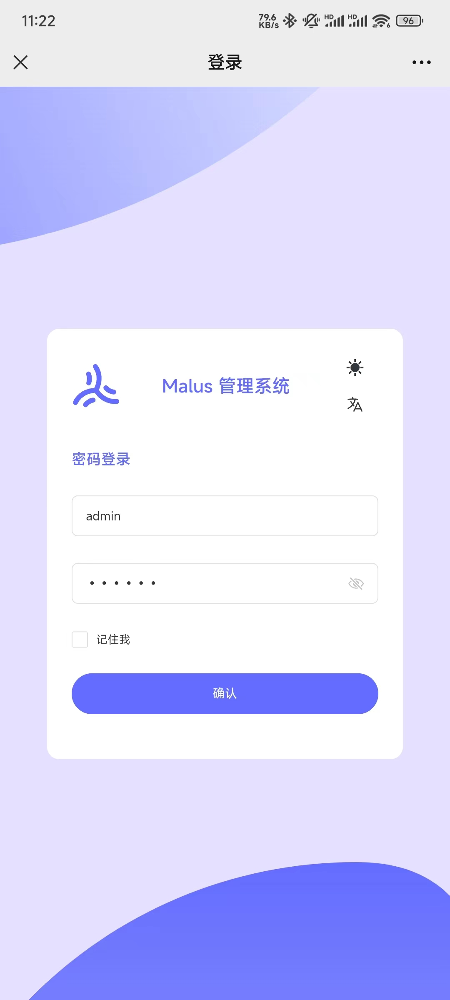
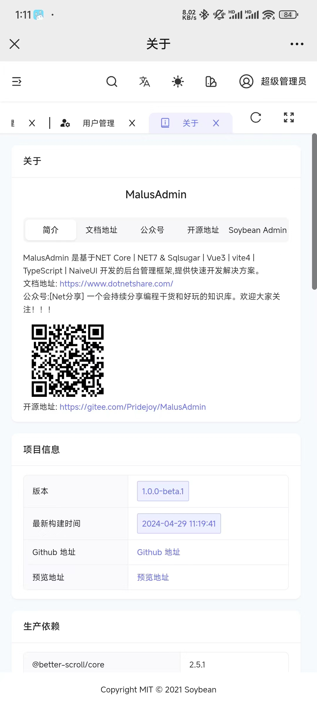
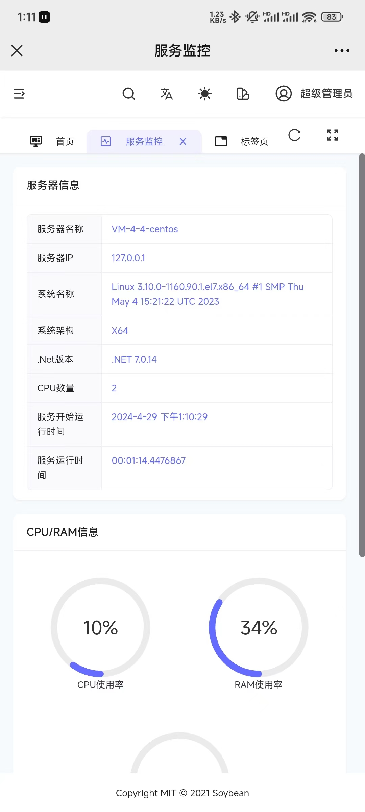
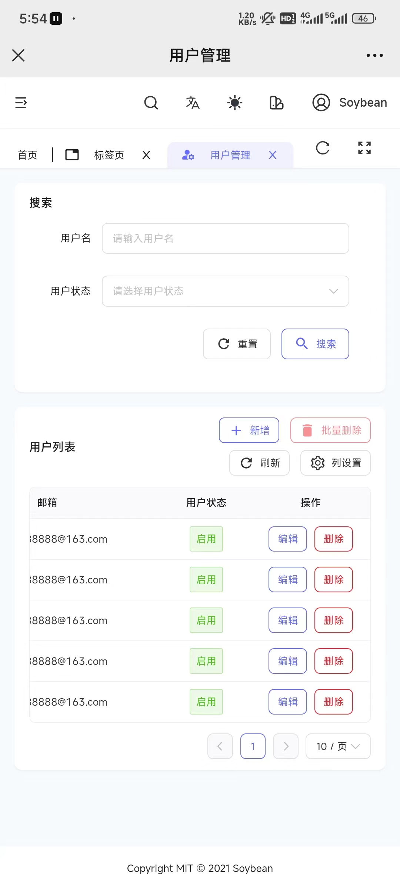
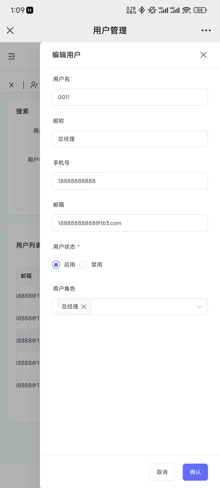

<h1 align="center" style="margin: 30px 0 30px; font-weight: bold;">MalusAdmin</h1>
<h4 align="center">基于 Vue3/TypeScript/NaiveUI 和 NET7 & Sqlsugar  开发的后台管理框架。采用最原生最简洁的方式来实现,
前端清新优雅高颜值，后端 结构清晰，优雅易懂，功能强大</h4>

       
    
    
    

## 简介

Malus是海棠的意思，顾名思义，海棠后台管理系统，读音与【马卢斯】相近，也可称作为马卢斯后台管理系统。

基于NET Core  | NET7/8 & Sqlsugar  | Vue3 | vite4 | TypeScript | NaiveUI  开发的前后端分离式权限管理系统,采用最原生最简洁的方式来实现,
前端清新优雅高颜值，后端 结构清晰，优雅易懂，功能强大,提供快速开发的解决方案。 

 > [!NOTE] 如果您觉得  `MalusAdmin` 对您有所帮助，或者您喜欢我们的项目，请在 GitHub 上给我们一个 ⭐️。您的支持是我们持续改进和增加新功能的动力！感谢您的支持！

## 特性

前后端分离，使用 JWT 认证。

后端：基于 .NET7 和 [sqlsugar](https://www.donet5.com/Home/Doc?typeId=1215) ，集成常用组件，从0到1搭建。

前端：基于 [Soybean Admin](https://gitee.com/honghuangdc/soybean-admin) 做适配，主技术栈：Vue3、**NaiveUI 版本**

极简的项目依赖，简洁清爽的目录结构，代码注释方便上手

 >  数据库文件见【doc/dbsql/20240429.sql】

## 预览

MalusAdmin 提供了以下演示和文档资源：

- 账户信息：账号 `admin`，密码 `1Q2W3E`
- 在线演示系统：[Malus 管理系统](https://malus.dotnetshare.com/)
- 后端文档：[DotNet分享](https://www.dotnetshare.com/)
- 前端文档：[前端文档](https://docs.soybeanjs.cn/zh/)
- Naive UI 文档：[Naive UI 文档](https://www.naiveui.com/zh-CN/os-theme/docs/installation)

## 演示

<table>
    <tr>
        <td></td>
        <td></td> 
    </tr>
    <tr>
        <td></td>
        <td></td> 
    </tr>
    <tr>
        <td></td>
        <td></td>  
    </tr>
      <tr>
        <td></td>
        <td></td>  
    </tr>
      <tr>
        <td></td>
        <td></td>  
    </tr>

</table>

## 手机演示

直接手机端上完美的运行，一套代码三端俱全。

<table>
    <tr>
        <td></td>
        <td></td> 
    </tr>
    <tr>
        <td></td>
        <td></td> 
    </tr>
    <tr>
          <td></td> 
        <td></td>  
    </tr>
   

</table>

 

 ## 交流

- 请移步右上角  **一键三连** :kissing_heart
- 公众号：
- 若发现bug，请提Issues。

## 开源

**源于开源，回归开源**

* 感谢Soybean Admin开源的[Soybean Admin](https://gitee.com/honghuangdc/soybean-admin) 
* 感谢SqlSugar开源的[SqlSugar](https://www.donet5.com/Home/Doc?typeId=1215) 
* 感谢Naive UI 开源的[Naive UI](https://www.naiveui.com/zh-CN/os-theme)
* 感谢 柒愿 开源的[QiAdmin](https://gitee.com/zero202101/QiAdmin)