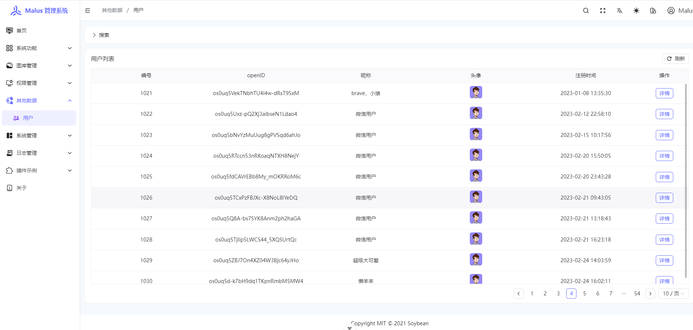
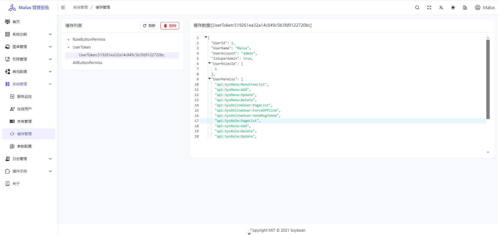
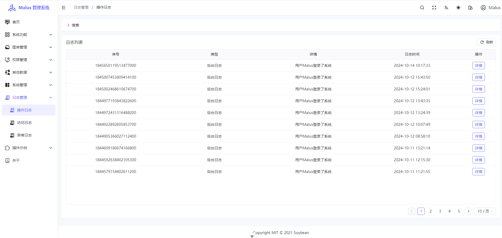
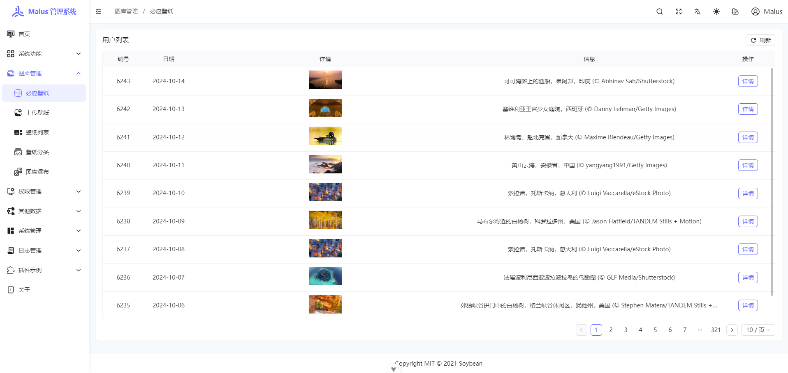
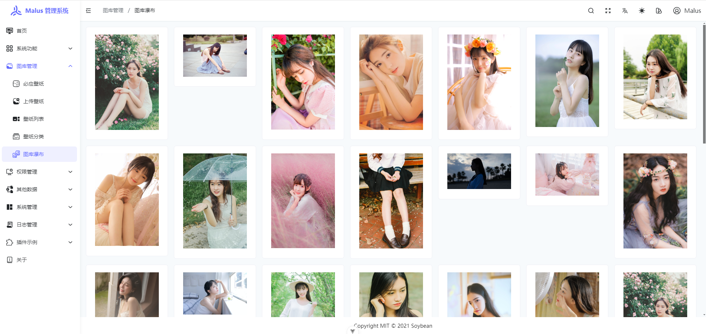

 

       
    
    
    

[在线体验](https://malus.dotnetshare.com) |[帮助文档](https://www.dotnetshare.com)

 
 

    如果对您有帮助，您可以点右上角 "Star" ❤️ 支持一下 谢谢！

## 简介

Malus 是海棠的意思，顾名思义，海棠后台管理系统，读音与【马卢斯】相近，也可称作为马卢斯后台管理系统。

基于 NET Core | NET7/8 & Sqlsugar | Vue3 | vite4 | TypeScript | NaiveUI 开发的前后端分离式权限管理系统,采用最原生最简洁的方式来实现,
前端清新优雅高颜值，后端 结构清晰，优雅易懂，功能强大,提供快速开发的解决方案。

## 特性

前后端分离，使用 JWT 认证。

后端：基于 .NET7 和 [sqlsugar](https://www.donet5.com/Home/Doc?typeId=1215) ，集成常用组件，从 0 到 1 搭建。

前端：基于 [Soybean Admin](https://gitee.com/honghuangdc/soybean-admin) 做适配，主技术栈：Vue3、**NaiveUI 版本**

极简的项目依赖，简洁清爽的目录结构，代码注释方便上手

## 预览&文档

MalusAdmin 提供了以下演示和文档资源：

-   账户信息：（超管） 账号 `admin`，密码 `关注公众号回复·密码·获取`
-   在线演示系统：[https://malus.dotnetshare.com](https://malus.dotnetshare.com/)
-   后端文档：[https://www.dotnetshare.com](https://www.dotnetshare.com/)
-   前端文档：[https://docs.soybeanjs.cn](https://docs.soybeanjs.cn/zh/)
-   Naive UI 文档：[https://www.naiveui.com](https://www.naiveui.com/zh-CN/os-theme/docs/installation)
-   SqlSugar 文档：[https://www.donet5.com](https://www.donet5.com/Home/Doc?typeId=1215)

> PS: 不要乱改密码、权限、删除数据~

## 资源

### 前端项目
> 前端项目同步更新地址：https://gitee.com/Pridejoy/soybean-admin-net
### 数据库文件
> 数据库文件见 [mysql 和 sqlserver](https://gitee.com/Pridejoy/MalusAdmin/tree/master/doc/dbsql)

## 演示截图

直接手机端上完美的运行，一套代码三端俱全。

|                           |                           |
| --------------------------------------------------------- | ----------------------------------------------------------- |
|                           |                           |
|                           |                           |
|                           |                           |
|                          |                           |
|                          |                          |
|                          |                          |
|                          |                          |
|  |  |
|  |  |
|  |  |

## 交流

-   请移步右上角 **一键三连** : kissing_heart
-   若发现 bug，请提 Issues。
-   如对博客内容，知识，排版等有疑问或者建议，欢迎邮件和我联系

**邮箱:pridejoy@foxmail.com**

## 开源

-   感谢 SqlSugar 开源的[SqlSugar](https://www.donet5.com/Home/Doc)
-   感谢 Soybean Admin 开源的[Soybean Admin](https://gitee.com/honghuangdc/soybean-admin)
-   感谢 SqlSugar 开源的[SqlSugar](https://www.donet5.com/Home/Doc?typeId=1215)
-   感谢 Naive UI 开源的[Naive UI](https://www.naiveui.com/zh-CN/os-theme)
-   感谢 柒愿 开源的[QiAdmin](https://gitee.com/zero202101/QiAdmin)

## Star History

## Stargazers over time

## Project Status

## Contributors

Thanks for all their contributions!

## License

[MIT](LICENSE)
